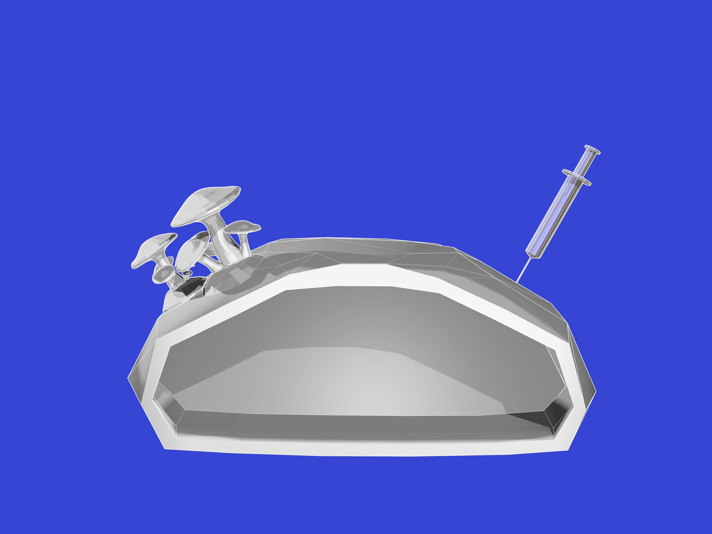

# Johan
## Documentation

### Project: Grow Your Lab and Eat It
<strong>keywords: </strong>
 sustainability, local resources, upcycling, biodegradable, uncommon combos, fermenting, active cultures, auto genesis, meta building, recursive process, robotics, wet bots, food server
 
 <strong>introduction:</strong>
 You can have your cake and eat it too. Mushrooms can be eaten and their mycelium substrate can be shaped and baked into myco materials and objects. Kombucha tea can be consumed, and the scoby can be dried and processed into fruit leather for fashion. Meanwhile many of the kitchen waste materials can be upcycled by introducing them into the production stream. Coffee grounds and old bread can be used as mycelium substrate. Old tea and coffee can be used to create cellulose. 
  The properties of myco materials are: hard, light, water resistant and fire retardent. The properties of cellulose materials are: light, flexible and water absorbant. The combination of those two materials should make it possible to create some lab equipment while maitaining the ideal conditions for the production of materials and edible by-products. The proposed experiment would attempt to build a fermenting lab for various active cultures (sourdough starter, kombucha tea and coffee, mycelium, koji and others) where the output of the lab is used to grow the lab itself and add extensions on the go. This auto-genesis would add archeological layers of dead and active material, both in a bottom up and horizontal expansive manner.
  The lab experiment could churn out new materials as combinations of the materials and active cultures could cross-ferment or contaminate. It could also have autonomy to decide how much of the output to feed to humans and how much to use to expand itself and scale up its future production of volume or materialistic diversity. The lab could be extended with modular hi-tech/low-tech such as a sourdough starter gun printer, a kombucha overflow gletcher, a koji foam slicer or a myco bake-and-preserve flame thrower.
 <strong>conclusion:</strong>
 Since the process of growing active cultures is slow and complex we have only been able to research the aquisition and inoculation of substrates to date. We have not yet been able to experiment with applying these inoculations to pre-shaped objects and lab building yet, something we hope to achieve by this summer.

 

### Devices Made so far
#### Tube Rack
 

#### Magnetic Stirrer

#### Clean Bench
clean bench prototype
  

#### incubator / temperature humidity controlled grow box

 a prototype with light, temperature and humidity control
 humidity > magnetic resonance atomizer with water level sensor auto-switch off
 temperature cold > peltier device with heat sinks and fans
 temperature warm > ceramic heat resistors and aluminium foil heat mat, aquarium heater

## Saturday February 24th, 2018/ Kannai UINIMLKU
Pleurotus Ostreatus - winter oyster mushroom obtained from Waag
 Mycelium 
 - Waag Pleurotus Ostreatus http://biohackacademy.github.io/bha5/organisms/mycelium/
 to be grown on malt agar http://biohackacademy.github.io/bha4/cultivation-media/malt-agar/
 Malt Agar (MA)
 Non-selective medium suitable for growing yeast and fungi, for example slime molds.
 
 Compound	Amount	Unit
 Malt extract	30.0	g
 Agar	20	g
 Demi water	up to 1000	mL
 Set pH ~5.5

## Week of March 5th, 2018
substrates prepared:
 
 straw (boiled 40min),palm tree husk (boiled 40min), rice hull (boiled 40min),steamed rice, brown rice, brown rice flour, mix of brown rice and brown rice flour, kombucha scoby, coffee grounds
 
 warm box and 9 substrates inoculated with koji, trying to keep the temperature between 30-60C
 
 cold box and 9 substrates inoculated with king oyster mushroom, trying to keep the temperature between 15-20C and hunidity at 95%
 challenge: incubator / temp-humidity controlled box not ready yet
 
 <strong>King Oyster Mushroom Grow Kit</strong>
 obtained from amazon.co.jp
 https://www.amazon.co.jp/gp/product/B0031XX3X4/ref=oh_aui_detailpage_o00_s00?ie=UTF8&psc=1
 received by mail, unboxed, bag cut open, top layer mycelium removed, soaked in cold water for 30 minutes, kept in dark coolbox at 95% humidity and 15-20C 
 last week of March first eringi mushrooms popping up
 

 <strong>kombucha scoby leather</strong>
 kombucha scoby with blue mold staining and  palm tree husk fibers
 
 
 various baked substrate tests on bed of palm husk kombucha scoby leather
 

## Saturday March 10th, 2018/ Kannai UINIMLKU
 eringi from substrate kit inoculated on plate of malt agar
 hiratake from old dongels inoculated on plate of malt agar

## Saturday March 17th, 2018/ Kannai UINIMLKU

 potato agar diy, boil potatoes, use boiled potato water and add additional water until 1L, 20g sugar, 20g agar
 inoculated plates with 
 hiratake from old dongels > some later turned out to be contaminated with purple bacteria
 hiratake from shop sample
 white button mushroom from shop sample > some later turned out to be contaminated with purple bacteria
 shimeji tiny mushroom  from shop sample
 sarunokoshikake white  from park sample
 sarunokoshikake dark  from park sample

## Monday March 19th, 2018

 liquid mycelium in honey water
 white button mushroom from spore printing > spores used
 hiratake mushroom from spore printing > no visible spores, so part of mushroom sample used
 shimeji mushroom from spore printing > no visible spores, so part of mushroom sample used
 sarunokoshikake mushroom from spore printing > no visible spores, so part of mushroom sample used
 shiitake mushroom from spore printing > no visible spores, so part of mushroom sample used

## Tuesday March 20th, 2018/ BioClub Shibuya - Liquid Mycelium

 autoclaving of honey water for liquid mycelium
 maitake from shop sample
 brown button mushroom from shop sample
 shiitake from shop sample
 winter oyster mushroom from plate

## Week of March 20th, 2018
 hydrated soy beans, garbanzo beans, corn, bird food seeds for koji inoculation and kept in 30C incubator
 hydrated sunflower seeds, soy beans, garbanzo beans, corn, bird food seeds for mycelium inoculation

## Tuesday March 27th, 2018/ BioClub Shibuya
 received slime mold plates
 autoclaved sunflower seeds for mycelium inoculation with winter oyster mushroom

## Saturday March 31st, 2018 / BioClub Shibuya
 31/3/2018 winter oyster mushroom inoculation
 200ml water
 6g nutrients (peptone 11 plates, 9 plates potato dextrose, 8 plates yeast extract, 9 plates mix of all three)
 4g agar
 autoclave 121C 20min resulted in brown/yellow (caramelized?) solution

## Resources
other resources for future reference
まいたけ 鋸屑種菌 １０００ｃｃ > spawn saw dust maitake
http://www.grantomato.co.jp/ecscripts/reqapp.dll?APPNAME=forward&PRGNAME=gr_item_list_mei&ARGUMENTS=-A,-A4943066328236
http://www.mitsunobu-nouen.com/shopdetail/004028000021/
http://www.kinoko-nichino.com/htmls/tuushinhanbai-tyumon-nyuryoku.htm

