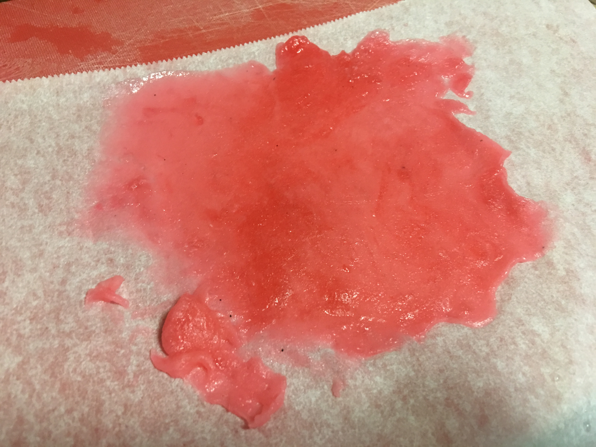
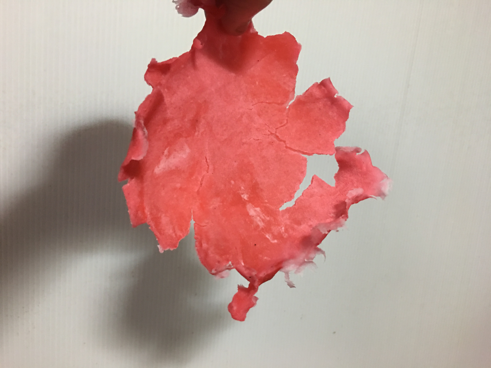
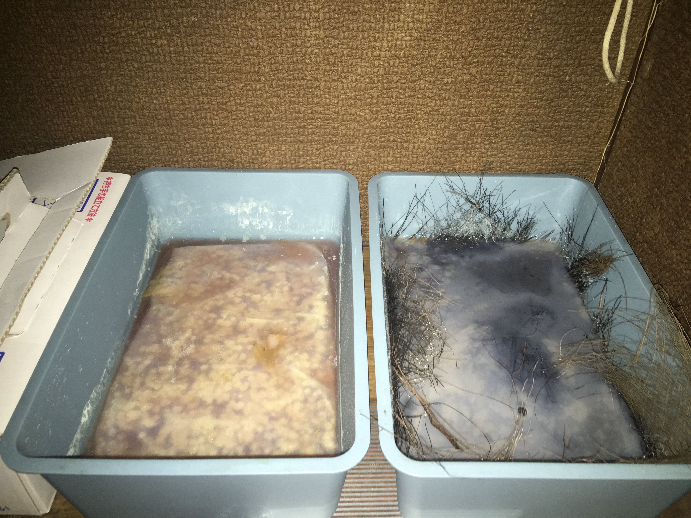

# Johan
## Documentation

Devices Made so far
Tube Rack

Magnetic Stirrer

Devices to make

Clean Bench

incubator / temperature humidity controlled grow box

Project
Experimenting with Biomaterials
- local fibers: palm husk
- food waste: coffee grounds, old bread
- kombucha leather
- mycobricks

2018-03-10 report

substrates prepared:
straw (boiled 40min),palm tree husk (boiled 40min), rice hull (boiled 40min),steamed rice, brown rice, brown rice flour, mix of brown rice and brown rice flour, kombucha scoby, coffee grounds

warm box and 9 substrates inoculated with koji, trying to keep the temperature between 30-60C

cold box and 9 substrates inoculated with king oyster mushroom, trying to keep the temperature between 15-20C and hunidity at 95%

challenge: incubator / temp-humidity controlled box not ready yet

bioplastic with starch, agar, water, vinegar,

bioplastic end result hard but easily snaps to break > next time try to add glycerin

kombucha scoby left with blue mold staining
kombucha scoby right with palm tree husk fibers

Resources
Mycelium 
- Waag Pleurotus Ostreatus http://biohackacademy.github.io/bha5/organisms/mycelium/
to be grown on malt agar http://biohackacademy.github.io/bha4/cultivation-media/malt-agar/
Malt Agar (MA)
Non-selective medium suitable for growing yeast and fungi, for example slime molds.

Compound	Amount	Unit
Malt extract	30.0	g
Agar	20	g
Demi water	up to 1000	mL
Set pH ~5.5

Biohacker Alternative
Malt extract can be easily made DIY style by boiling malt in water

Pleurotus Ostreatus - winter oyster mushroom
obtained from Waag

King Oyster Mushroom Grow Kit
obtained from amazon.co.jp
https://www.amazon.co.jp/gp/product/B0031XX3X4/ref=oh_aui_detailpage_o00_s00?ie=UTF8&psc=1

other resources for future reference
まいたけ 鋸屑種菌 １０００ｃｃ > spawn saw dust maitake
http://www.grantomato.co.jp/ecscripts/reqapp.dll?APPNAME=forward&PRGNAME=gr_item_list_mei&ARGUMENTS=-A,-A4943066328236
http://www.mitsunobu-nouen.com/shopdetail/004028000021/
http://www.kinoko-nichino.com/htmls/tuushinhanbai-tyumon-nyuryoku.htm

