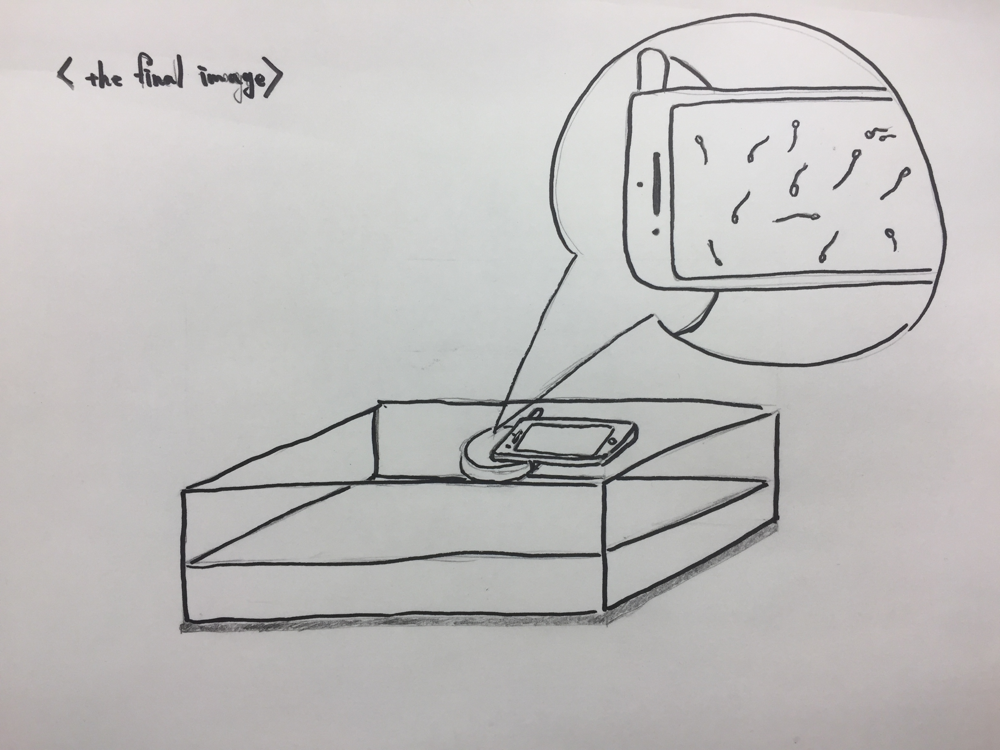
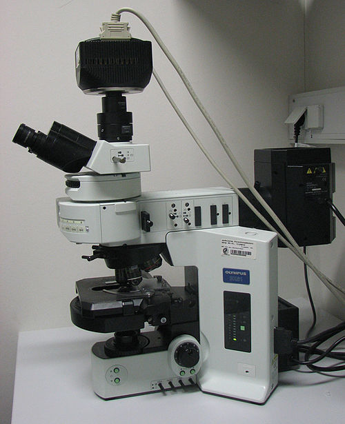

# Jun　Nishimura

### About Me
- who are you? 
  - I'm Jun Nishimura from Japan.
- what I'm interested in
  - gender/sexuality/erotics
  

- the reason I joined the biohack academy 
I'm originally interested in art, specifically erotic art. I was thinking that the application of the bio technologies should be discussed within not only scientists but also general people. Then I found the bio community in Japan named bioClub, and then I knew this biohack academy. I don't have biology background, so I thought this would be a good chance to expose myself into the world of biology.

### Final Presentation
#### the project overview

|  | Plan A | Plan B |
|:-----------:|:-----------:|:------------:|
| title | what is beatiful and what is dirty? | the world in 0.06mm |
| video | [vimeo link](https://vimeo.com/258767241) | [vimeo link](https://vimeo.com/259296278) |
| final goal |  |  |

#### time schedule

|  | Plan A | Plan B |
|:-----------:|:-----------:|:------------:|
| 3/10(Saturday) | make a stirrer & an agar plate |  |
| 3/13(Tuesday) | start growing the bacteria |  |
| 3/17(Saturday) |  | get the centrifuge |
| 3/20(Tuesday) | check what kind of bacteria I have |  |
| 3/24(Saturday) |  | finish taking the video & finish making the DIY microscope |
| 3/27(Tuesday) |  | finish making the sperm object |
| 3/31(Saturday) | final adjustment | final adjustment |
| 4/2(Monday) | final presentation | final presentation |

#### what I need
- the centrifuge
- DMEM
- TENGA MEN's Loupe
- condomm
- 3D printer

#### work with
- the lab in Tukuba university (if possible) to use DIC(Differential Interface Contrast) microscopy. DIC microscopy creates the high resolution image for the thin optical section

### what is DIC(Differential Interface Contrast) microscopy?
- (from Wikipedia) DIC is a optical microscopy technique used to enhance the contrast in unstained, transparent samples. 

#### about the sperm 
- how long can sperm live outside?
  - if you are following the procedure of 

