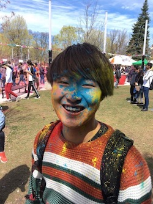

# Jun　Nishimura

### About Me
- who are you?
  - I'm Jun Nishimura from Japan.
- what I'm interested in
  - gender/sexuality/erotics
- hobby
  - delusion
- what I like
  - Thai food/manga

- the reason I joined the biohack academy 
I'm originally interested in art, specifically erotic art. I was thinking that the application of the bio technologies should be discussed within not only scientists but also general people. Then I found the bio community in Japan named bioClub, and then I knew this biohack academy. I don't have biology background, so I thought this would be a good chance to expose myself into the world of biology.

### Final Presentation
#### the project overview
I want to make an art work with my genital bacteria or sperm.

#### background 
In public, topics related to erotics tends to be put into the backside of the world. Talking about sex in public is taboo and erotics is treated as the dirty thing.(I don't know about other countries, but at least in Japan it is.) I don't like this situation. Thus I want to throw the question to the public by creating an art work.

#### what I use

#### what I do 

