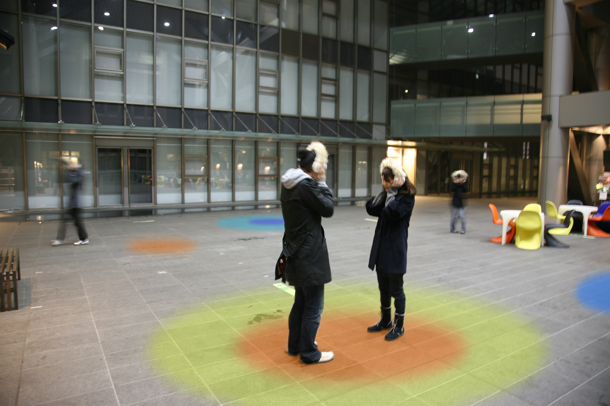

hello
This is Youngah's page!

*Name* Young ah SEONG

*Now* Project Researcher 

*Interests | Keywords*
- Human Emotion (Preference, Perception-linked, BCI-based) 
- Human Communication (Artificial Serendipity, Mental Health, Mind Hack) 
- Daily Life Style (User Behavior, Unmet Needs, Personal Memory) 
- Data Visualization (Infographic, Adapted Data, Human Feedback) 
- Scent Sensing / Thermal Feedback 
- Speculative Concept Design / Circular Design / Social Impact Design
- Ecosystem in Business (Information driven digital economy, Value Chain) 

## 3/10 Research

midterm presentation 
-> https://github.com/BioHackAcademy/BioHackAcademy.github.io/wiki/Midterm-Youngah-seong

##research
How to get permition from gorvenment
-> https://www.nta.go.jp/tetsuzuki/shinsei/annai/sake/annai/23600069.htm

How to make Mackgeoli
-> https://mmpkorea.wordpress.com/makgeolli-homebrew-resources/

The gut-brain axis: interactions between enteric microbiota, central and enteric nervous systems
-> https://www.ncbi.nlm.nih.gov/pmc/articles/PMC4367209/

Metagenomic Analysis
-> https://ci.nii.ac.jp/naid/10027869009

Metagenomics
-> https://en.m.wikipedia.org/wiki/Metagenomics

##memo

SFC鶴岡にEDNA分析器が結構ある
-> https://orf.sfc.keio.ac.jp/2017/exhibition/b35/

Information Visualization
-> https://personal.broadinstitute.org/bang/bang-wong--work.html

## 1/30 1st meeting
### What is bio Hacking?

possibility of change
unexpected and elegant solutions

_Test Image_

thermotaxis by yonakani
